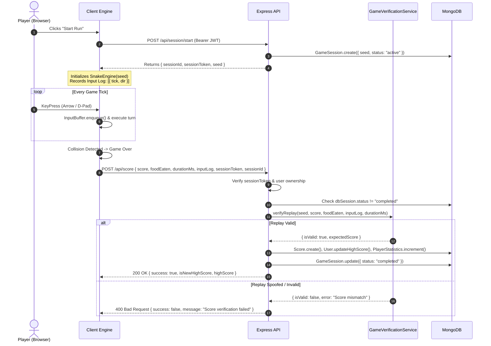

# System Architecture & Technical Specifications — Snake Arcade

## 1. System Overview & Technology Stack

Snake Arcade is architected as a decoupled, high-performance web application consisting of a deterministic client-side game engine and an anti-cheat verification backend API.

```
┌─────────────────────────────────────────────────────────────────────────┐
│                           CLIENT (Browser)                              │
│  ┌──────────────────┐   ┌──────────────────┐   ┌─────────────────────┐  │
│  │ HTML5 Canvas 2D  │   │  FIFO Turn Buffer│   │  Web Audio Engine   │  │
│  │ 60 FPS Renderer  │   │  (Anti-180° Lock)│   │  (Synth Oscillators)│  │
│  └────────┬─────────┘   └────────┬─────────┘   └─────────────────────┘  │
│           │                      │                                      │
│           ▼                      ▼                                      │
│  ┌───────────────────────────────────────────────────────────────────┐  │
│  │              Deterministic SnakeEngine (Mulberry32 PRNG)          │  │
│  └───────────────────────────────┬───────────────────────────────────┘  │
│                                  │ (JWT Session + Seeded Input Log)     │
└──────────────────────────────────┼──────────────────────────────────────┘
                                   │ HTTPS / REST
                                   ▼
┌─────────────────────────────────────────────────────────────────────────┐
│                       BACKEND (Node.js + Express 5)                     │
│  ┌───────────────────────────────────────────────────────────────────┐  │
│  │ Security Middleware (Helmet CSP, CORS, RateLimiters, SlowDown)    │  │
│  └───────────────────────────────┬───────────────────────────────────┘  │
│                                  │                                      │
│  ┌───────────────────────────────▼───────────────────────────────────┐  │
│  │  GameVerificationService (Full Deterministic Replay Simulation)   │  │
│  │  - Validates Seed, Physics, Speeds, Collision Boundaries & Food   │  │
│  └───────────────────────────────┬───────────────────────────────────┘  │
│                                  │ Verified Score Commit                │
│                                  ▼                                      │
│  ┌───────────────────────────────────────────────────────────────────┐  │
│  │                     MongoDB Database (Mongoose)                   │  │
│  │  [Users]  │  [Scores]  │  [GameSessions]  │  [PlayerStatistics]   │  │
│  └───────────────────────────────────────────────────────────────────┘  │
└─────────────────────────────────────────────────────────────────────────┘
```

### Complete Tech Stack

| Layer | Technology | Rationale / Purpose |
|---|---|---|
| **Frontend Framework** | React 19 / Vite | Sub-millisecond HMR, zero-overhead bundle footprint, reactive HUD overlays. |
| **Game Renderer** | HTML5 Canvas 2D API | Hardware-accelerated 60 FPS rendering decoupled from React DOM reconciliation. |
| **Styling** | Tailwind CSS + Tailwind Merge | Micro-hairline borders, tactical HUD styling, Obsidian Arcade theme tokens. |
| **Icons & UI** | Lucide React | Clean, lightweight SVG iconography for telemetry, volume, and control badges. |
| **Audio** | Web Audio API (`AudioContext`) | Zero-latency procedural sound synthesis (sine/square oscillator frequency ramps). |
| **Client Auth** | Google Identity Services (GIS) | Standard Google Sign-In with credential token exchange. |
| **Backend Framework** | Node.js (ES Modules) + Express 5 | High throughput, modern asynchronous request handling and ES module standard. |
| **Database** | MongoDB 6+ with Mongoose 9 | Document storage for user profiles, session logs, scores, and player telemetry. |
| **Security Suite** | Helmet, HPP, RateLimiters | Content Security Policy, HTTP Parameter Pollution defense, IP rate limiting. |
| **Validation** | Zod | Runtime type safety and schema validation for score payloads and auth tokens. |
| **Anti-Cheat** | Mulberry32 PRNG Simulation | Server-authoritative deterministic replay verification before writing to database. |
| **Testing** | Vitest + Supertest | Blazing fast ESM-native unit and integration test suites. |
| **CI/CD** | GitHub Actions | Automated build verification, linting, and containerized MongoDB test suite on push. |

---

## 2. Directory Structure

```
snake_game/
├── .github/
│   └── workflows/
│       └── ci.yml                     # Continuous Integration workflow
├── .cursor/
│   └── rules/                         # AI development instruction rules
│       ├── general.mdc
│       ├── frontend.mdc
│       ├── backend.mdc
│       └── testing.mdc
├── docs/
│   ├── PRD.md                         # Product Requirements Document
│   ├── ARCHITECTURE.md                # System Architecture & Data Flow (This File)
│   ├── DESIGN.md                      # Obsidian Arcade Design System
│   ├── RULES.md                       # Development Standards & Constraints
│   ├── TASKS.md                       # Roadmap & Task Breakdown
│   ├── DECISIONS.md                   # Architecture Decision Records (ADRs)
│   ├── MEMORY.md                      # Project Status & Working State
│   ├── TEST_PLAN.md                   # Test Matrix & QA Protocols
│   └── SECURITY.md                    # Threat Model & Anti-Cheat Specs
├── client/
│   ├── public/                        # Static assets (favicons, manifest)
│   ├── src/
│   │   ├── assets/                    # Branding and static imagery
│   │   ├── components/
│   │   │   ├── game/                  # CanvasBoard, GameHUD, Controls, Modals
│   │   │   ├── leaderboard/           # LeaderboardCard, Ranking tables
│   │   │   ├── settings/              # SettingsPanel, Volume, Theme toggles
│   │   │   └── ui/                    # Button, Card, Dialog, Badge, Slider primitives
│   │   ├── context/
│   │   │   └── AuthContext.jsx        # Google auth state & session provider
│   │   ├── engine/                    # Core Game Engine (Canvas, Audio, Math)
│   │   │   ├── __tests__/             # Engine unit test suite
│   │   │   ├── AudioEngine.js         # Procedural sound synthesizer
│   │   │   ├── CanvasRenderer.js      # 60fps high-DPI canvas render pipeline
│   │   │   ├── CollisionSystem.js     # Wall & self collision checks
│   │   │   ├── Constants.js           # Grid size, speed deltas, status enums
│   │   │   ├── DifficultySystem.js    # Progressive speed tier calculator
│   │   │   ├── InputBuffer.js         # 2-slot FIFO queue with anti-180° protection
│   │   │   ├── Random.js              # Seeded Mulberry32 PRNG generator
│   │   │   └── SnakeEngine.js         # Master game loop & state manager
│   │   ├── hooks/
│   │   │   └── useSnakeGame.js        # React hook binding engine to UI state
│   │   ├── pages/
│   │   │   ├── GamePage.jsx           # Main arcade cockpit arena
│   │   │   └── LoginPage.jsx          # Dedicated authentication view
│   │   ├── services/
│   │   │   └── api.js                 # Axios/Fetch API client with auth headers
│   │   ├── App.jsx                    # Root routing & layout container
│   │   ├── main.jsx                   # React entry point
│   │   └── index.css                  # Tailwind styles and theme CSS variables
│   ├── package.json
│   ├── vite.config.ts
│   └── .env.example
├── server/
│   ├── src/
│   │   ├── config/                    # DB connection & environment helpers
│   │   ├── controllers/
│   │   │   ├── authController.js      # Google OAuth verification & JWT issuance
│   │   │   └── scoreController.js     # Session start, score save, leaderboard
│   │   ├── middleware/
│   │   │   ├── authMiddleware.js      # JWT authorization & user attachment
│   │   │   ├── errorMiddleware.js     # Centralized 404 & 500 error handlers
│   │   │   └── rateLimiter.js         # Login, Score, API, and SlowDown limiters
│   │   ├── models/
│   │   │   ├── GameSession.js         # Cryptographic active session registry
│   │   │   ├── PlayerStatistics.js    # Lifetime gameplay counters
│   │   │   ├── Score.js               # Historical score & replay inputs record
│   │   │   └── User.js                # Player profile, high score, Google auth ID
│   │   ├── routes/
│   │   │   ├── authRoutes.js          # /api/auth/google, /api/auth/me
│   │   │   └── scoreRoutes.js         # /api/session/start, /api/score, /api/leaderboard
│   │   ├── services/
│   │   │   └── verificationService.js # Deterministic replay verification engine
│   │   ├── utils/
│   │   │   └── logger.js              # Winston structured logger
│   │   └── server.js                  # Express app initialization & server bootstrap
│   ├── tests/
│   │   ├── integration/
│   │   │   └── api.test.js            # REST endpoint integration tests
│   │   └── unit/
│   │       └── verification.test.js   # Anti-cheat verification unit tests
│   ├── package.json
│   └── .env.example
├── README.md                          # Main project guide
└── .env.example                       # Root environment reference
```

---

## 3. Data Flow & Anti-Cheat Protocol

### Sequence Diagram: Game Lifecycle & Verified Submission



---

## 4. Key Architectural Boundaries & Rules

1. **Deterministic Physics Separation:**
   - The game physics engine (`SnakeEngine.js`) MUST remain 100% pure JavaScript, completely isolated from React DOM rendering or browser event loop timings.
   - All randomness MUST pass through `Random.js` (Mulberry32 PRNG) using the server-issued seed. `Math.random()` is strictly forbidden in game physics.

2. **Server-Side Authority on Leaderboard Writes:**
   - The server NEVER trusts client-claimed scores directly. Every authenticated score write MUST supply a valid `sessionToken` and `inputLog` that successfully verifies in `GameVerificationService.verifyReplay()`.

3. **Stateless Scalable Verification:**
   - The replay verifier is a pure computational function running in \(O(T)\) where \(T\) is the total tick count (typically < 10ms CPU time for a 10-minute game). It requires no heavy headless browser instances or server-side game loops during active play.

4. **Fault-Tolerant Database Queries:**
   - All public endpoints (e.g. `GET /api/leaderboard`) incorporate query timeouts (`.maxTimeMS(3000)`) and connection ready-state checks to prevent hanging HTTP sockets if the database encounters transient delays.
